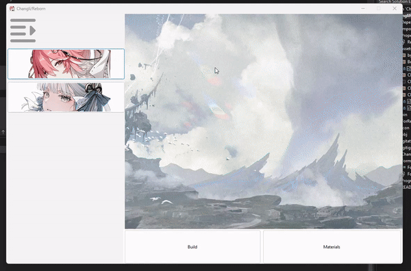
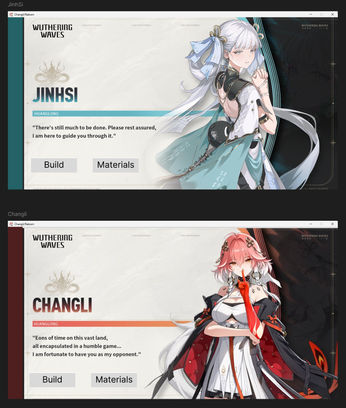
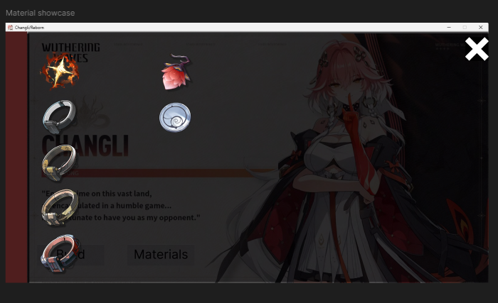

# Project::Changli/Reborn
# IMPORTANT: A NEW BACKEND SYSTEM IS BEING DEVELOP IN THE `new-backend-system` BRANCH

## 16-07-2024, new sidebar implementation merged from `new-backend-system`, now just gotta work on the `build` and show `material` button MaN....
### What is the purpose of new-backend-system ?
Because the last code structure requires manually adding and code the whole button and functions, it makes the app not recycle-able, so the point of this new implementation is to allow for easier adding new data to the system

### Code Changes:
- the sidebar is now FlowLayoutPanel
- scrollable sidebar
- new form AddCharacterForm and AddSuccessForm
- add UI for adding new character data/JSON in real time
- add precache Character system
- new class WuWaButton
- add system to automatically create and bind Character to WuWaButton
- add system to automatically bind function to WuWaButton
- JSON also include skill materials

### Refactor
- Move Character into new folder and CharacterClass namespace
- Move other classes into classes folder

## 19-07-2024, added fully working function when clicking `material` button.
- The application is now able to scan and cache according material images based on different character's data
- However, there are some memory leaks here and there, but we're workking on it :)

## You will need Visual Studio with .NET pack to run this project
This project is still in the works, however this is some expected images of the app:

Demonstration:

(Materials design is in the works, might update later)

Basically by utilizing the `TableLayoutPanel` as the blueprint for the Layout, using `pictureBox` to store and load pictue from local files

The data is handle by reading the `json` file in `assets/CharacterBuild`
